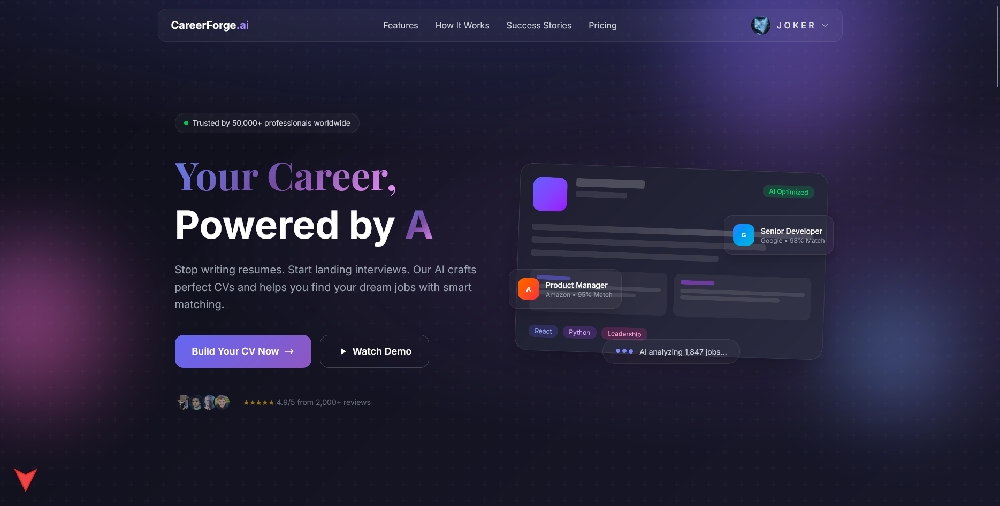
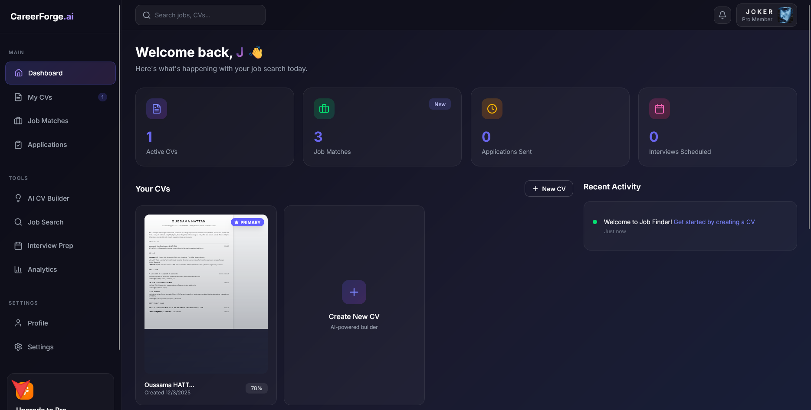
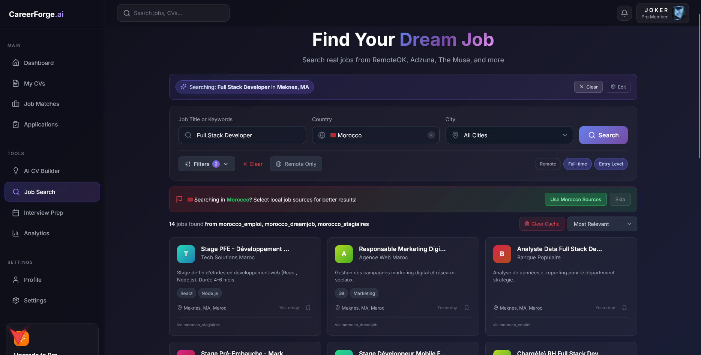
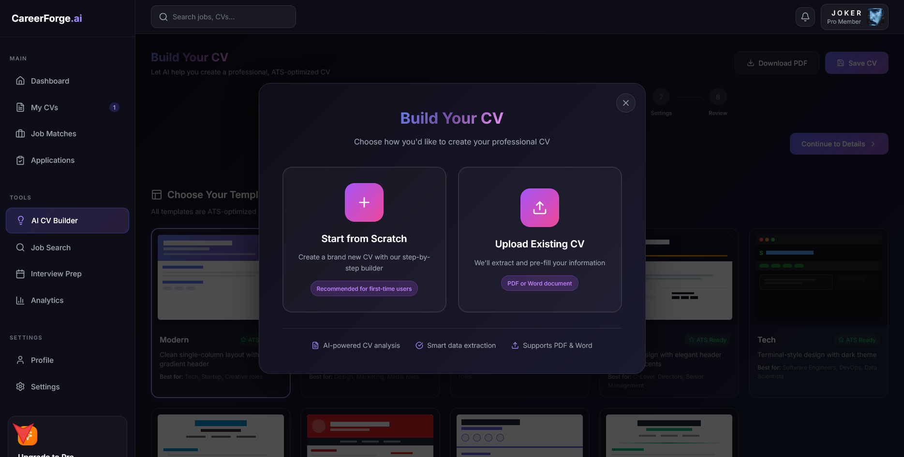
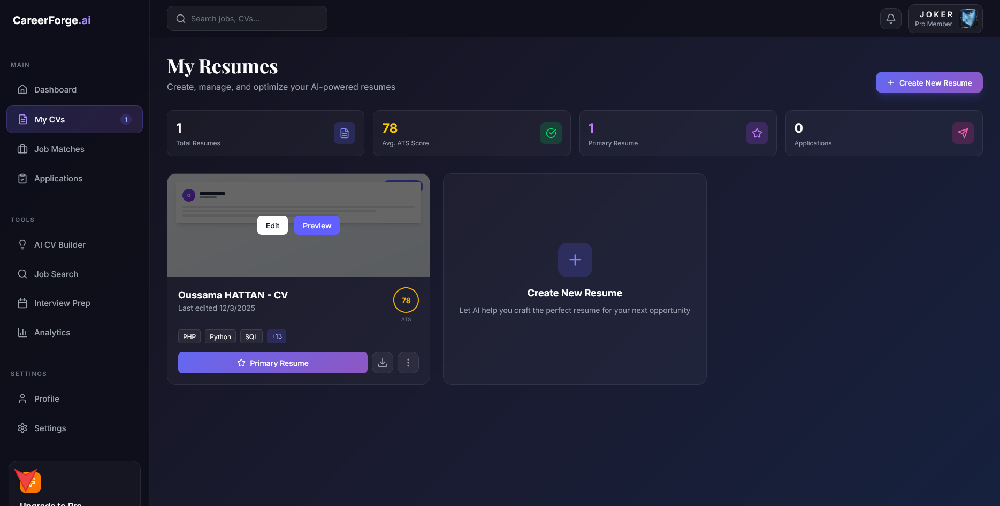
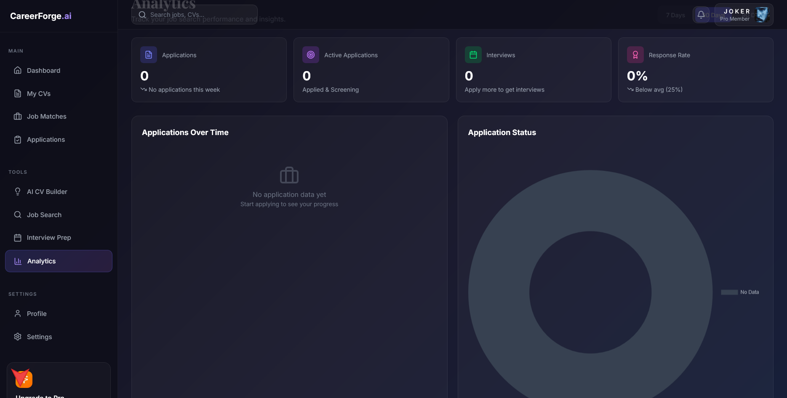
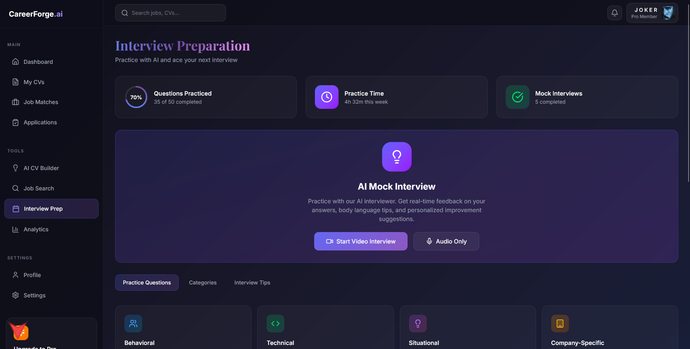
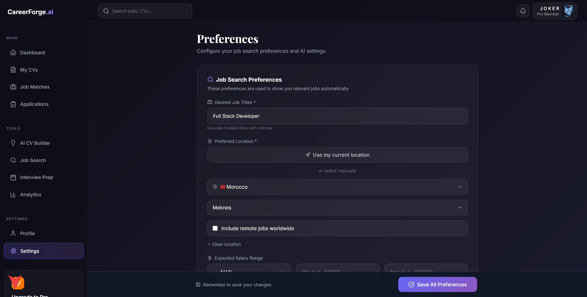
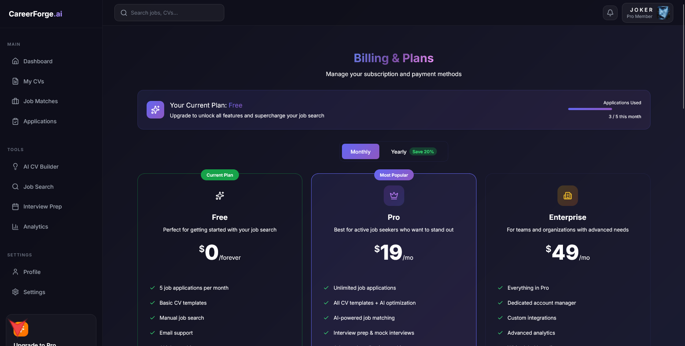

# 🚀 CareerForge.ai (Job Finder)

[](https://nextjs.org/)
[](https://reactjs.org/)
[](https://supabase.com/)
[](https://tailwindcss.com/)

CareerForge.ai is an advanced, AI-powered career management platform designed to revolutionize the job seeking experience. From building ATS-optimized resumes to automating job applications across multiple platforms, CareerForge.ai handles the heavy lifting of your job search.

---

## 📸 Project Showcase

### 🌐 Landing Page & Hero


### 📊 Professional Dashboard


### 🔍 Advanced Job Search


### 📝 AI CV Builder
<p align="center">
  
  
</p>

### 📈 Analytics & Insights


### 💡 Interview Preparation


### ⚙️ Customizable Preferences


### 💳 Flexible Pricing Plans


---

## ✨ Key Features

### 🤖 AI-Powered CV Builder
- **ATS Optimization**: Create resumes that pass automated screening systems.
- **AI Content Generation**: Personalized bullet points and summaries based on your experience.
- **Multiple Templates**: Choose from Modern, Creative, Executive, and Minimalist designs.
- **PDF Export**: One-click download of your professionally formatted resume.

### 🕵️ Global Job Search & Discovery
- **Multi-Platform Search**: Aggregates jobs from 11+ major platforms.
- **Advanced Filtering**: Filter by salary, location, job type, and experience level.
- **Skills Matching**: Real-time analysis of how well you match specific job requirements.
- **Smart Tracking**: Save jobs and track their application status effortlessly.

### ⚡ Auto-Apply System (Pro)
- **Automated Applications**: AI automatically generates personalized cover letters and applies to matching jobs.
- **Batch Processing**: Set daily limits and minimum match scores for automated searching.
- **Real-time Integration**: Connects with external APIs to handle the application flow.

### 📊 Analytics & Tracking
- **Application Funnel**: Track your progress from "Applied" to "Interviews" and "Offers".
- **Skill Gap Analysis**: Visualizes your top skills and identifies areas for improvement.
- **Weekly Progress**: Interactive charts showing your application activity over time.

### 💬 Interview Preparation
- **AI Mock Interviews**: Practice with role-specific questions.
- **Behavioral & Technical Sets**: Categorized question banks with difficulty levels.
- **Instant Feedback**: Get suggested improvements for your answers.

---

## 🚀 Tech Stack

- **Core**: [Next.js 16](https://nextjs.org/) (App Router), [React 19](https://reactjs.org/)
- **Styling**: [Tailwind CSS 4](https://tailwindcss.com/), CSS Modules
- **Database & Auth**: [Supabase](https://supabase.com/) (PostgreSQL + RLS)
- **AI Engine**: [Google Generative AI (Gemini)](https://ai.google.dev/) / Claude (via OpenRouter)
- **Icons**: [Lucide React](https://lucide.dev/)
- **Data Visualization**: [Chart.js](https://www.chartjs.org/)
- **Document Processing**: `html2canvas`, `jspdf`, `mammoth`, `pdf-parse`

---

## 🛠️ Installation & Local Setup

### 1. Clone the Repository
```bash
git clone https://github.com/your-username/Job-Finder.git
cd Job-Finder
```

### 2. Install Dependencies
```bash
npm install
```

### 3. Environment Configuration
Create a `.env.local` file in the root directory:
```env
NEXT_PUBLIC_SUPABASE_URL=your_supabase_url
NEXT_PUBLIC_SUPABASE_ANON_KEY=your_supabase_anon_key
NEXT_PUBLIC_SITE_URL=http://localhost:3000
GOOGLE_AI_API_KEY=your_gemini_api_key
```

### 4. Database Setup
1. Create a new project in [Supabase](https://app.supabase.com).
2. Run the SQL provided in `supabase_schema.sql` and the files in `migrations/` folder within the Supabase SQL Editor.
3. Enable Email or Social Auth (Google, GitHub, LinkedIn) in the Auth settings.

### 5. Start Development
```bash
npm run dev
```

---

## 📁 Project Structure

- `app/`: Next.js App Router pages and API routes.
- `components/`: Reusable React components (UI, Landing, Dashboard, CV).
- `hooks/`: Custom React hooks for data fetching and state management.
- `utils/`: Helper functions, Supabase configuration, and AI logic.
- `migrations/`: SQL scripts for database schema updates.
- `public/`: Static assets and icons.

---

## 🚢 Deployment

### Railway (Recommended)
1. Link your GitHub repo to [Railway](https://railway.app/).
2. Add your environment variables in the Railway dashboard.
3. Railway will automatically detect the Next.js build and deploy your app.

### Vercel
1. Import the project to [Vercel](https://vercel.com/).
2. Configure environment variables.
3. **Deploy!**

---

## 🔒 License

This project is licensed under the **ISC License**.

## 🤝 Contributing

Contributions are what make the open source community such an amazing place to learn, inspire, and create. Any contributions you make are **greatly appreciated**.

1. Fork the Project
2. Create your Feature Branch (`git checkout -b feature/AmazingFeature`)
3. Commit your Changes (`git commit -m 'Add some AmazingFeature'`)
4. Push to the Branch (`git push origin feature/AmazingFeature`)
5. Open a Pull Request

---

Built with ❤️ by [H_Oussama](https://github.com/H_Oussama)
